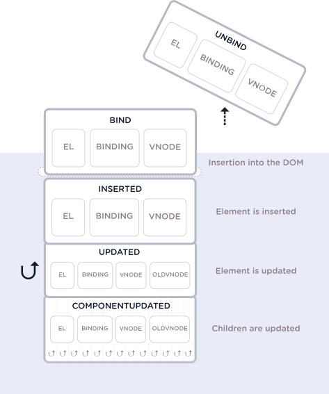

# 65.  ### Что такое the директива Hook Arguments?

All the hooks have `el`, `binding`, and `vnode` as arguments. Along with that, **update** and **componentUpdated** hooks expose `oldVnode`, to differentiate between the older value passed and the newer value. Below are the arguments passed to the hooks,
     1. `el`: The element the directive is bound to and it can be used to directly manipulate the DOM.
     2. `binding`: An object containing the following properties.
        1. `name`: The name of the directive, without the `v-` prefix.
        2. `value`: The value passed to the directive. For example in `v-my-directive="1 + 1"`, the value would be 2.
        3. `oldValue`: The previous value, only available in update and componentUpdated. It is available whether or not the value has changed.
        4. `expression`: The expression of the binding as a string. For example in `v-my-directive="1 + 1"`, the expression would be "1 + 1".
        5. `arg`: The argument passed to the directive, if any. For example in v-my-directive:foo, the arg would be "foo".
        6. `modifiers`: An object containing modifiers, if any. For example in v-my-directive.foo.bar, the modifiers object would be `{ foo: true, bar: true }`.
     3. `vnode`: The virtual node produced by Vue’s compiler.
     4. `oldVnode`: The previous virtual node, only available in the update and componentUpdated hooks.

     The arguments can be represented diagrammatically across the hooks as below,
     